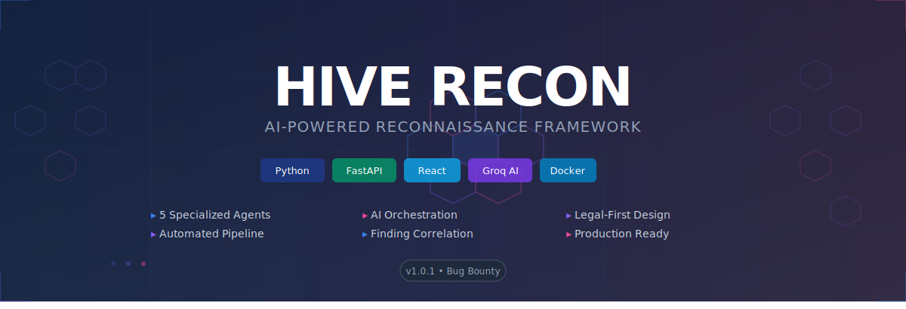
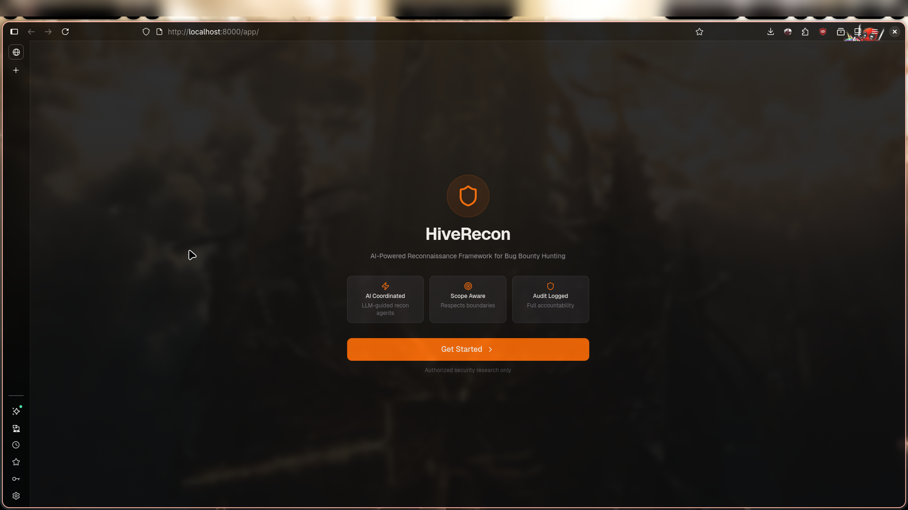
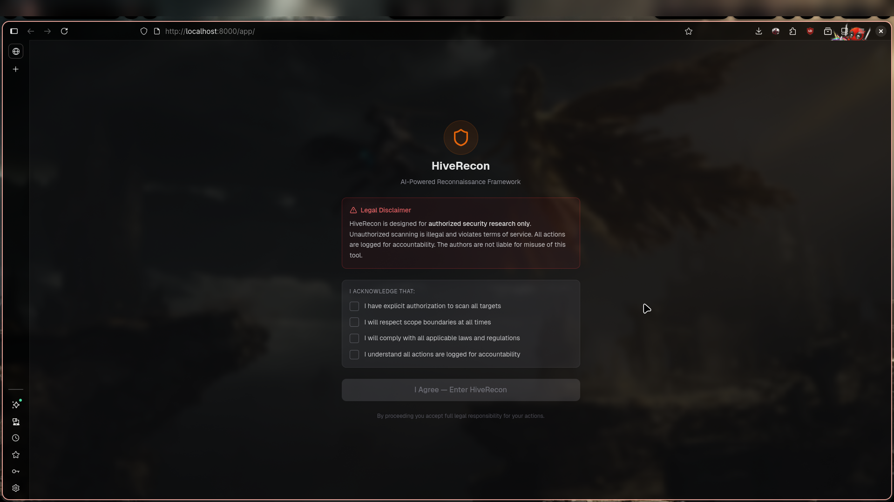
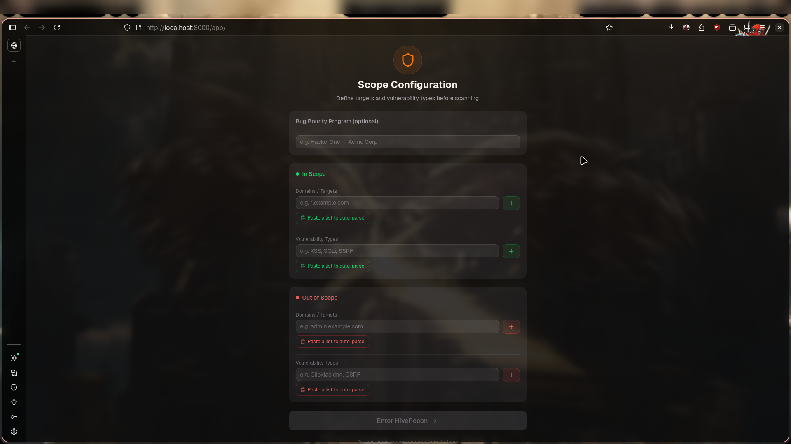

<p align="center">
  
</p>

<p align="center">
  <strong>AI-powered reconnaissance framework for bug bounty hunting</strong>
</p>

<p align="center">
  <a href="#features">Features</a> |
  <a href="#quick-start">Quick Start</a> |
  <a href="#architecture">Architecture</a> |
  <a href="#api-endpoints">API</a> |
  <a href="#project-structure">Structure</a> |
  <a href="#development">Development</a>
</p>

---

## Overview

HiveRecon automates the complete security reconnaissance pipeline -- from subdomain enumeration through vulnerability scanning -- using five specialized agents orchestrated by a central AI coordinator powered by Groq. The system provides a React-based web dashboard served from a single FastAPI container, with SQLite for data persistence and comprehensive audit logging for legal compliance.

## Features

- **Automated Reconnaissance Pipeline** -- Subdomain discovery, port scanning, endpoint discovery, and vulnerability scanning chained into a single workflow
- **AI Orchestration** -- Groq AI prioritizes targets, selects scan candidates, correlates findings, and generates executive summaries
- **Five Specialized Agents** -- Subdomain (subfinder/amass), Port Scan (nmap), Endpoint Discovery (katana/ffuf), Vulnerability Scan (nuclei), and MCP Server
- **Legal-First Design** -- Scope validation, audit logging, and boundary enforcement ensure only authorized targets are scanned
- **Finding Correlation** -- Cross-tool analysis reduces false positives and groups related findings
- **Educational Output** -- Beginner-friendly explanations for each finding with remediation guidance
- **Web Dashboard** -- React SPA with scan management, findings browser, real-time monitoring, and settings
- **Report Generation** -- PDF and Markdown reports for each scan
- **MCP Server** -- Model Context Protocol interface for external AI agent integration
- **Single-Container Deployment** -- Everything runs in one Docker container on port 8000

## Screenshots

<p align="center">
  
  <br><em>Welcome Screen</em>
</p>

<p align="center">
  
  <br><em>Legal Disclaimer — Authorization Acknowledgment</em>
</p>

<p align="center">
  
  <br><em>Scope Configuration — Define In/Out of Scope Targets</em>
</p>

## Tech Stack

| Component | Technology |
|-----------|------------|
| Language | Python 3.14 |
| Backend | FastAPI (async) |
| AI/LLM | Groq API (llama-3.1-8b-instant) |
| Database | SQLite + SQLAlchemy (async) |
| Frontend | React 19 + Vite + shadcn/ui |
| Container | Docker + Docker Compose |
| Recon Tools | subfinder, nmap, katana, nuclei, amass, ffuf |

## Quick Start

### Prerequisites

- Docker and Docker Compose
- A Groq API key (free at [console.groq.com](https://console.groq.com))

### Docker Deployment

```bash
git clone https://github.com/stack-guardian/HiveRecon.git
cd HiveRecon
```

Set your Groq API key in `docker-compose.yml`:

```yaml
environment:
  GROQ_API_KEY: "gsk_your_key_here"
```

Build and start:

```bash
docker compose build --no-cache app
docker compose up -d
```

Verify the deployment:

```bash
curl http://localhost:8000/health
# {"status":"healthy","version":"0.1.0","groq_configured":true}
```

Open the dashboard:

```
http://localhost:8000/app/
```

### Manual Installation

```bash
# Install Python dependencies
pip install -r requirements.txt

# Initialize database
python -c "from hiverecon.database import init_db; from hiverecon.config import get_config; import asyncio; asyncio.run(init_db(get_config().get_database_url()))"

# Start API server
uvicorn hiverecon.api.server:app --host 0.0.0.0 --port 8000
```

## Architecture

```
Incoming Request (port 8000)
    |
    v
FastAPI Server (uvicorn)
    |
    +-- API Routes (/health, /scans, /findings, /stats)
    |       |
    |       v
    |   SQLite Database (aiosqlite)
    |       |
    |       v
    |   HiveMindCoordinator
    |       |
    |       +-- Groq API (cloud, llama-3.1-8b-instant)
    |       +-- Recon Agents (subfinder, nmap, katana, nuclei)
    |       +-- Parsers, Correlation, Audit Logger
    |
    +-- Static Files (/app/, /assets/, /favicon.svg)
            |
            v
        React SPA (Vite production build)
```

### Scan Pipeline

```
subfinder --> AI Prioritize --> nmap --> AI Select --> katana --> AI Select --> nuclei
(subdomains)   (rank hosts)    (ports)  (top hosts)   (crawl)   (endpoints)   (vulnscan)
    |                                                                       |
    +---------------------------> AI Summary <------------------------------+
                                        |
                                        v
                                  Executive Report
```

## API Endpoints

| Method | Path | Description |
|--------|------|-------------|
| GET | `/` | API root information |
| GET | `/health` | Health check with Groq status |
| POST | `/scans` | Create new reconnaissance scan |
| GET | `/scans` | List all scans with filtering |
| GET | `/scans/{id}` | Get scan details |
| GET | `/scans/{id}/summary` | Get AI-generated summary |
| GET | `/scans/{id}/findings` | Get findings for specific scan |
| DELETE | `/scans/{id}` | Cancel a running scan |
| GET | `/findings` | List all findings across scans |
| GET | `/stats` | Overall statistics |
| GET | `/app/` | React dashboard SPA |
| GET | `/api/v1/reports/{id}/markdown` | Download Markdown report |

## Project Structure

```
hiverecon/
├── hiverecon/                  # Python package (backend core)
│   ├── agents/                 # 5 recon agents (subfinder, nmap, katana, nuclei, MCP)
│   ├── core/                   # HiveMindCoordinator, parsers, correlation, audit
│   ├── api/                    # FastAPI server and report endpoints
│   ├── config.py               # Pydantic configuration system
│   ├── database.py             # SQLAlchemy ORM models
│   └── cli.py                  # Command-line interface
├── dashboard/                  # React frontend
│   └── src/
│       ├── pages/              # 8 dashboard pages
│       ├── components/         # shadcn/ui components
│       └── api.js              # API client
├── config/                     # YAML configuration
├── docs/                       # Extended documentation
├── scripts/                    # Utility scripts
├── docker-compose.yml          # Single-service deployment
├── Dockerfile                  # Container build definition
└── ARCHITECTURE.md             # Complete technical documentation
```

## Dashboard Pages

| Page | Purpose |
|------|---------|
| Dashboard | Statistics cards, scan status chart, recent scans |
| New Scan | Target input, scope configuration, scan launch |
| Scan Monitor | Real-time scan progress tracking |
| Findings | Filterable vulnerability findings table |
| Scope Config | In-scope/out-of-scope domain management |
| Settings | Groq API key, model selector |
| Legal | Terms acknowledgment |
| Welcome | Onboarding for new users |

## Configuration

### Environment Variables

| Variable | Purpose | Default |
|----------|---------|---------|
| `GROQ_API_KEY` | Groq API authentication | (required) |
| `DATABASE_URL` | Database connection string | `sqlite+aiosqlite:///./hiverecon.db` |
| `AI_MODEL` | Override AI model | `llama-3.1-8b-instant` |

### Available AI Models

- `llama-3.1-8b-instant` (default, fast)
- `llama-3.3-70b-versatile` (higher quality)
- `mixtral-8x7b-32768` (large context)
- `gemma-7b-it` (lightweight)

## Development

### Running Tests

```bash
pytest tests/ -v
```

### Building the Dashboard

```bash
cd dashboard
npm install --legacy-peer-deps
npm run build
```

### Code Style

```bash
# Formatting
black hiverecon/

# Linting
ruff check hiverecon/

# Type checking
mypy hiverecon/
```

## Documentation

- [ARCHITECTURE.md](ARCHITECTURE.md) -- Complete technical architecture (872 lines)
- [docs/README.md](docs/README.md) -- Extended setup and troubleshooting guide
- [QUICKSTART.md](QUICKSTART.md) -- Quick start guide
- [DOCKER.md](DOCKER.md) -- Docker deployment details
- [PROJECT_STATUS.md](PROJECT_STATUS.md) -- Feature completion tracker
- [ROADMAP.md](ROADMAP.md) -- Future development plan

## Known Limitations

- **Subfinder config warning** -- Non-blocking permission warning during subdomain enumeration. Does not affect functionality.
- **SQLite concurrency** -- Limited concurrent write support. Adequate for single-user deployment. PostgreSQL recommended for production multi-user scenarios.
- **No authentication** -- Dashboard has no user authentication. Add JWT auth before network-exposed deployment.

## License

MIT License -- see [LICENSE](LICENSE) for details.

## Author

**Vibhor Prasad** ([@stack-guardian](https://github.com/stack-guardian))
